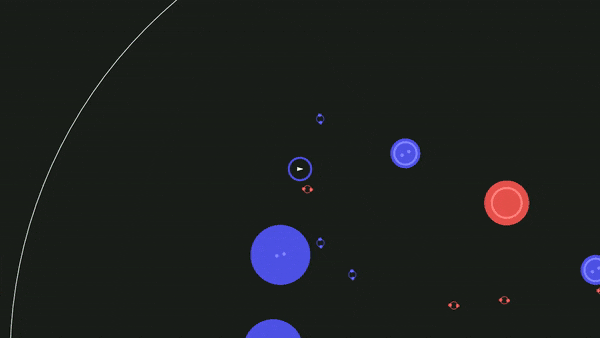

# MAC0346/2019 - Terceiro Exercício-Programa



Nesse EP vocês implementarão uma simulação interativa com física e gráficos
simples usando a [LÖVE](https://love2d.org). 

**Este EP deve ser feito sozinho ou em dupla**.

**Prazo: domingo, 29/9, até as 22h**. Atrasos são permitos com desconto de 10 pontos por dia sobre a nota máxima.

1. [Formato de entrega](#1-formato-de-entrega)
   1. [Projeto LÖVE](#11-projeto-löve)
   2. [Relatório](#12-relatório)
2. [Especificação do simulador](#2-especificação-do-simulador)
   1. [Arquivos de entrada](#21-arquivos-de-entrada)
      1. [Cenas](#211-cenas)
      2. [Especificações de entidades](#212-especificações-de-entidades)
   2. [Propriedades](#22-propriedades)
      1. [Posição](#221-posição)
      2. [Movimento](#222-movimento)
      3. [Corpo](#223-corpo)
      4. [Controle](#224-controle)
      5. [Campo e carga](#225-campo-e-carga)
   3. [Desenhando as entidades](#23-desenhando-as-entidades)
3. [Avaliação](#3-avaliação)

## 1. Formato de entrega

Vocês deverão entregar um arquivo comprimido (zip ou tar.gz) contendo

1. O projeto LÖVE do visualizador de vocês (ver [Seção 1.1](#11-projeto-löve))
2. Um relatório com explicações da sua implementação
   (ver [Seção 1.2](#12-relatório)

### 1.1 Projeto LÖVE

Seu projeto LÖVE deverá seguir os conformes da LÖVE, isso é, deve consistir de
uma pasta com um arquivo `main.lua` onde as funções de ponto de entrada para sua
implementação são fornecidas. Além do código-fonte da sua implementação, a pasta
do seu projeto deverá conter todos os ***assets*** usados pelo simulador,
que, no caso, são as cenas para simular e as especificações de cada tipo de
entidade. Se você tiver outros *assets* além disso, inclua-os!

Na hora de executar seu projeto, ele deverá receber pela linha de comando o
nome da cena que irá carregar. Por exemplo, neste repositório o arquivo
`scene/test.lua` é uma cena cujo nome é `test` (isto é, o nome do arquivo sem o
caminho e sem a extensão, por convenção). Então para carregá-lo usando seu
visualizador, o comando seria:

```bash
$ love <seu-projeto> test
```

Onde `<seu-projeto>` é o caminho para a pasta do seu projeto LÖVE.
**Prefiram usar as funções `require` ou `love.filesystem.load` para carregar
arquivos, pois elas buscam os caminhos a partir da raiz do projeto**.

Cada cena, por sua vez, refencia as especificações de entidades `entity/*.lua`
pelo nome. Explicamos melhor o formato desses arquivos
[adiante](#21-arquivos-de-entrada).

Além disso, estamos incluindo neste repositório dois arquivos para ajudar vocês:

1. `class.lua`: implementação de orientação objetos do
   [Penlight](https://github.com/stevedonovan/Penlight)
   ([documentação](http://stevedonovan.github.io/Penlight/api/manual/01-introduction.md.html#Simplifying_Object_Oriented_Programming_in_Lua))
2. `common/vec.lua`: uma classe para vetores em R² (usa `class.lua`) com
   operadores sobrecarregados

### 1.2 Relatório

Junto com seu projeto LÖVE, vocês deverão entregar um relatório em TXT ou PDF
contendo:

1. Nome e número USP da dupla
2. Breve descrição (uma frase) do que cada módulo da sua implementação faz
3. Quais [tarefas](#3-avaliação) vocês completaram
4. Quaisquer outras observações que vocês achem pertinentes para a correção

**O relatório serve, dentre outras coisas, para facilitar a correção e ajudar
vocês a justificarem suas escolhas de implementação**. Por isso, divulgaremos
primeiro a nota dos EPs que estiverem com relatório completo e adequado.

## 2. Especificação do Simulador

Nessa simulação interativa trabalharemos primariamente com mecânicas de física.
Há vários tipos de entidades contidas no espaço de simulação que podem interagir
de diversas maneiras. O espaço consiste em uma área circular de 1000 pixels de
raio, da qual nenhuma entidade pode sair. Na falta de uma entidade controlada
pelo usuário, **o centro da tela do jogo deve estar posicionado na origem do
espaço**.

As entidades dessa simulação podem ter as seguintes propriedades:

1. Posição (`position`)
2. Movimento (`movement`)
3. Corpo (`body`)
4. Campo (`field`)
5. Carga (`charge`)
6. Controle (`control`)

A combinação dessas propriedades determina o "tipo" da entidade, então, em
teoria, existem $`2^6 = 64`$ possíveis tipos. Na prática, nem todos fazem
sentido, mas ainda sobram várias combinações. Por isso, a ideia
desse EP é aplicar o padrão Entity-Component-System visto em aula, mas não é
obrigatório.

### 2.1 Arquivos de entrada

Há dois tipos de arquivos de entrada: cenas e especificações de entidades.

#### 2.1.1 Cenas

O formato de cenas é bem simples: o arquivo deve prover uma lista de "grupos"
de entidades para instanciar no começo da simulação. Um grupo é dado pelo nome
da especificação da entidade e a quantidade de instâncias, na forma de uma
tabela `{ entity = "entity-name", n = 42}`. O arquivo resultante fica algo do
gênero:

```lua
return {
  { entity = 'player', n = 1 },
  { entity = 'some-entity', n = 10 },
  { entity = 'another-entity', n = 5 },
  -- ...
}
```

Veja o arquivo `scene/test.lua` para um exemplo completo.

Quando a cena é carregada, além de instanciar as quantidades indicadas de cada
tipo de entidade, o EP também deverá posicioná-las aleatoriamente no espaço de
simulação, e dar um movimento inicial aleatório para cada uma. A distribuição
de probabilidade usada não importa, contanto que os objetos não apareçam todos
na mesma posição.

### 2.1.2 Especificações de entidades

O formato de especificação de entidade é uma tabela que descreve o estado
inicial das propriedades da entidade. Uma vez instanciada uma entidade a partir
de uma especificação, o estado dela vai mudar ao longo da simulação. Instâncias
diferentes possuem estados independentes!

A tabela da especificação da entidade tem uma entrada para cada propriedade que
a entidade tem, e cada entrada pode indicar os valores iniciais dos atributos da
propriedade. Se não houver a entrada de uma propriedade, é porque a entidade
não tem essa propriedade. Se ela tem a propriedade, mas não indica o valor dos
atributos, são usados os valores padrão, conforme esse exemplo:

```lua
return {
  position = {
    point = Vec(0, 0)
  },
  movement = {
    motion = Vec(0, 0)
  },
  body = {
    size = 8
  },
  control = {
    acceleration = 0.0,
    max_speed = 50.0,
  },
  field = {
    strength = 1
  },
  charge = {
    strength = 1
  }
}
```

Para exemplos concretos de especificações de entidades, veja os arquivos
`entity/*.lua` neste repositório, que são usados na cena de exemplo
`scene/test.lua`. Quando uma propriedade é apenas uma tabela vazia, é porque
seus atributos são inicializados com os valores padrão acima. Quando a
especificação de uma entidade tem a propriedade posição, só que vazia, você pode
opcionalmente atribuir uma posição aleatória a ela dentro do espaço delimitado
de simulação. A cena e as especificações de teste neste repositório supõem que
você faz isso, mas não importa muito como como você distribui as entidades
contanto que elas não comecem sempre amontoadas na origem.

### 2.2 Propriedades

Uma entidade pode ter qualquer combinação de propriedades. Algumas propriedades
tem interações diferentes dependendo das outras propriedades que a mesma
entidade tem. Cada propriedade tem seus próprios atributos, que são
inicializados com os valores especificados nos arquivos de cena ou de
especificação de entidade.

#### 2.2.1 Posição

A propriedade de posição é a mais básica que uma entidade pode ter, e permite
que ela participe do espaço virtual da simulação. Se uma entidade não tiver
essa propriedade, ela não interfere no mundo virtual nem é desenhada — é
praticamente como se ela não existisse. Essa propriedade possui um atributo:

+ `point` (vec): o ponto no espaço onde a entidade está posicionada

Entidades podem estar apenas dentro do espaço delimitado da simulação (um
círculo de 1000 pixels de raio). Se ela sair dessa região, ela deve ser
transportada para o lado oposto. Como a região delimitada da simulação está
centrada na origem (0, 0), para fazer essa translação basta inverter o sinal da
posição da entidade.

#### 2.2.2 Movimento

A propriedade de movimento permite que a entidade mude de posição ao longo do
tempo de simulação. Sem essa propriedade, a entidade nunca deve se mover! Essa
propriedade possui um atributo:

+ `motion` (vec): vetor velocidade da entidade

Todo quadro do jogo, as entidades com propriedade de movimento devem mover
suas posições de acordo com vetor `motion` usando a fórmula clássica da
cinemática:

```math
x \leftarrow x + \vec{v} \Delta t
```

Onde $`x`$ é a posição da entidade (campo `position.point`), $`\vec{v}`$ é
a velocidade da entidade no quadro atual (campo `moviment.motion`) e
$`\Delta t`$ é o parâmetro passado para o `love.update` no mesmo quadro.

#### 2.2.3 Corpo

A propriedade de corpo indica que uma entidade ocupa um certo volume no
espaço e possui uma massa própria, impedindo que outras entidades ocupem o
mesmo espaço que ela. Uma entidade com corpo bloqueia o movimento de qualquer
entidade que tenha a propriedade movimento, mesma que esta não tenha um corpo.
Essa propriedade possui um atributo:

+ `size` (number): tamanho e massa da entidade

Esse atributo é usado para determinar se duas entidades estão em colisão e
também afeta como forças são aplicadas sobre a entidade. Toda entidade tem um
formato circular, então elas estão colidindo se a distância entre seus centros
é menor que a soma dos seus raios:

```math
\| \overrightarrow{x_1 - x_2} \| < r_1 + r_2 \Rightarrow colisão!
```

Onde $`x_1`$ e $`x_2`$ são as posições das entidades (`position.point`) e
$`r_1`$ e $`r_2`$ são seus respectivos raios (`body.size`). Se uma das entidades
não tiver corpo, considere que seu tamanho é de 8 pixels de raio.

Pela fórmula acima, quando duas entidades colidem elas já estão em um
estado inválido, pois elas estão "uma dentro da outra". Para tratar isso, você
precisa fazer duas coisas:

1. Restaurar a posição delas para um estado válido
2. Cortar o movimento delas na direção de colisão

Basta fazer isso com uma das entidades em colisão (a que tem a propriedade
movimento). Para (1) restaurar a posição, você desloca a entidade escolhida para
longe da outra uma distância igual ao quanto ela entrou na outra:

```math
x_2 \leftarrow x_2 + l \vec{d}
```

Onde $`l`$ é a distância que a entidade em movimento entrou na entidade com
corpo, dada pela diferença entre a soma dos raios e a distância entre elas:

```math
l = (r_1+r_2) - \|\Delta \vec{x}\|
```

E $`\vec{d}`$ é o vetor normalizado da direção para fora da colisão:

```math
\vec{d} = \frac{\Delta \vec{x}}{\| \Delta \vec{x} \|}
```

Nessas fórmulas, $`\Delta \vec{x}`$ é a diferença entre as posições das
entidades em colisão:

```math
\Delta \vec{x} = x_2 - x_1
```

Depois de corrigir a posição, você (2) subtrai do movimento da entidade
escolhida a componente da velocidade paralela à direção de saída da colisão:

```math
\vec{v_2} \leftarrow \vec{v_2} - (\vec{d} \cdot \vec{v_2}) \vec{d}
```

Onde $`\vec{v_2}`$ é a velocidade da entidade com movimento (`movement.motion`)
e $`\vec{d}`$ é o mesmo definido acima. Aqui, a componente do vetor de movimento
que é paralela à direção de saída da colisão é calculada usando produto escalar.

#### 2.2.4 Controle

A propriedade de controle possibilita que o usuário controle uma entidade com
movimento e posição. Deve haver no máximo uma entidade com controle em uma cena,
caso contrário o comportamento do EP é indeterminado (i.e. vocês não precisam
tratar esse caso). Se houver uma entidade controlada na simulação, a tela deve
estar sempre centralizada nela ao invés da origem. Essa propriedade possui dois
atributos:

+ `acceleration` (number): intensidade da aceleração de movimento do usuário
+ `max_speed` (number): velocidade máxima que a entidade controlada pode ter

Todo quadro do jogo, se alguma das teclas direcionais do teclado estiver
pressionada, você deverá aplicar uma aceleração correspondente no movimento
(se houver) da entidade controlada. Você pode usar qualquer outro conjunto de
teclas, contanto que você documente no relatório. Se mais de uma tecla estiver
pressionada ao mesmo tempo, você deve considerar a acelaração total delas.
O vetor resultante disso indica a direção a ser aplicada, enquanto que a sua
intensidade é dada pela a aceleração da propriedade de controle:

```math
\vec{v} \leftarrow \vec{v} + a \vec{i} \Delta t
```

Onde $`v`$ é a velocidade da entidade controlada (`movement.motion`), $`a`$ é
a aceleração (`control.acceleration`), $`\vec{i}`$ é o vetor da direção de
aceleração dado pelo controle do usuário, e $`\Delta t`$ é o passado para a
função `love.update`. Depois disso, você precisa limitar a velocidade da
entidade controlada para ela não ficar mais rápida que `control.max_speed`.
Se você estiver usando a classe `common.vec` deste repositório, o método
`Vec:clamp()` faz isso para você.

Note que como entidades com movimento mantêm sua velocidade como estado de um
quadro para o outro, o movimento do usuário fica com inércia: mesmo que você
solte as teclas, a entidade continua se movendo, só que sem acelerar mais.

#### 2.2.5 Campo e carga

As propriedades de campo e carga são duas propriedades muito parecidas que
interagem entre si. Elas simulam (de maneira completamente incorreta) a atração
e repulsão entre partículas com carga elétrica. Ambas possuem o mesmo atributo:

+ `strength` (number): intensidade (positiva ou negativa) do campo ou carga

Entidades com campo exercem seu campo de forças sobre entidades com carga e
movimento (se não tiver movimento, a força não se aplica). Essa força depende
das intensidades do campo e da carga, da distância entre elas, e de um fator
constante $`C = 1000`$:

```math
\vec{F} = C f q \frac{\overrightarrow{x_q - x_f}}
                     {\| \overrightarrow{x_q - x_f} \| ^2}
          
```

Onde $`f`$ e $`x_f`$ são a intensidade e a posição da entidade com campo e
$`q`$ e $`x_q`$ são a intensidade e a posição da entidade com carga. Com essa
fórumla, se a carga e o campo tiverem o mesmo sinal, o vetor dessa força afasta
a carga. Caso contrário, ela atrai a carga. Essa força é aplicada sobre a
entidade com carga usando a Segunda Lei de Newton, causando uma aceleração
$`\vec{a}`$ em seu movimento:

```math
\vec{a} = \frac{\vec{F}}{m}
```

Onde $`m`$ é a massa da carga — ou seja, o atributo `size` do seu corpo, se ela
tiver, ou 1 caso contrário. Dada essa aceleração, basta repetir a fórmula usada
na propriedade de controle:

```math
\vec{v_q} \leftarrow \vec{v_q} + \vec{a} \Delta t
```

Onde $`\vec{v_q}`$ é a velocidade da entidade com carga.

### 2.3 Desenhando as entidades

A maneira como uma entidade é desenhada na tela depende das suas propriedades.
Você não precisa desenhar corretamente uma propriedade para ganhar pontos pela
sua implementação: são critério separados na [avaliação](#3-avaliação).

**Posição**. Sem essa propriedade a entidade não deve nem aparecer na tela.
Toda entidade é desenhada, por padrão, como um círculo não-preenchido verde com
raio de 8 pixels. Outras propriedades podem mudar isso.

**Corpo**. Entidades com corpo são desenhadas como um círculo preenchido verde
cujo raio é dado pelo atributo `body.size`. O círculo padrão não é desenhado
nesse caso.

**Controle**. Entidades controladas possuem um triângulo branco no seu centro
indicando a direção para onde o usuário está aplicando a aceleração de
movimento, isto é, a direção que as teclas pressionadas apontam. Esse triângulo
precisa caber dentro do círculo mínimo de 8 raios de pixel, independente de
como o resto da entidade é desenhado.

**Campo**. Entidades com campo são desenhadas com um círculo não-preenchido
cuja cor e raio dependem da sua intensidade (`field.strength`). A cor é
vermelha se o campo for negativo, azul se for positivo, e verde se for neutro.
O raio é o valor absoluto da intensidade do campo. O círculo padrão não é
desenhado se a entidade tiver um campo e, se a entidade tem um corpo, o corpo
também é desenhado com a cor do campo.

**Carga**. Entidades com carga possuem um par de círculos pequenos, de 4 pixels
de raio, orbitando a uma distância de 8 pixels do seu centro. A cor desses
círculos é dada pela intensidade da carga: vermelho para negativo, azul para
positivo, e verde para neutro. A frequência de rotação desses círculos em torno
da entidade indicam o valor absoluto da carga usando a seguinte fórmula:

```math
\omega = \sqrt{|q|} Hz
```

Onde $`q`$ é a intensidade da carga (`charge.strength`) e $`\omega`$ é a
frequência de rotação em Hertz (ciclos por segundo).

Além disso, o EP deve desenhar o limite do espaço de simulação. Pode ser um
círculo de qualquer cor.

## 3. Avaliação

A avaliação será composta da soma de pontos obtidos por realizar diferentes
**tarefas** na sua implementação. A pontuação máxima é 100 e, como de costume,
há tarefas o suficiente para somar mais do que isso. As tarefas estão agrupadas
por categoria, e há um limite de nota que você pode obter vindo de tarefas de
uma mesma categoria:

| Categoria                 | Limite       | Código |
| ------------------------- | ------------ | ------ |
| Apresentação              |  30          | Ax     |
| Simulação                 |  40          | Sx     |
| Renderização              |  40          | Rx     |
| Qualidade de código       |  30          | Qx     |
| Efeitos adicionais        |  20          | Ex     |

**NO SEU RELATÓRIO, LEMBRE DE INDICAR QUAIS TAREFAS VOCÊS CUMPRIRAM**.
Sugiro usar os códigos!

| Código | Tarefa                                                     | Máximo |
| ------ | ---------------------------------------------------------- | ------ |
| A1     | Atender o formato de entrega                               | 10     |
| A2     | Executar sem erros                                         | 10     |
| A3     | Relatório completo e adequado                              | 20     |
| A4     | Arquivo [conf.lua][1] apropriado                           | 10     |
| A5     | Cenas e entidades adicionais de teste                      | 10     |
| S1     | Limitar o espaço de simulação                              | 10     |
| S2     | Propriedade de posição                                     |  5     |
| S3     | Posicionar aleatoriamente entidades sem posição explícita  |  5     |
| S4     | Propriedade de movimento                                   | 10     |
| S5     | Propriedade de corpo                                       | 10     |
| S6     | Propriedade de controle                                    | 10     |
| S7     | Propriedades de campo e carga                              | 20     |
| R1     | Centralizar a tela na origem                               |  5     |
| R2     | Renderizar os limites do espaço de simulação               |  5     |
| R3     | Renderizar a propriedade de posição                        | 10     |
| R4     | Renderizar a propriedade de corpo                          | 10     |
| R5     | Renderizar a propriedade de controle                       | 10     |
| R6     | Centralizar a tela na entidade controla, se houver         | 10     |
| R7     | Renderizar a propriedade de campo                          | 10     |
| R8     | Renderizar a propriedade de carga                          | 10     |
| Q1     | Passar no [luacheck](https://github.com/mpeterv/luacheck)  | 20     |
| Q2     | Organizar em módulos (1)                                   | 10     |
| Q3     | Organizar em funções (2)                                   | 10     |
| Q4     | Nomes claros de variáveis, funções e módulos               |  5     |
| E1     | Usar uma arquitetura Entity-Component-System               | 10     |
| E2     | Opção para dar *zoom in* e *out* na câmera                 | 10     |
| E3     | Não posicionar aleatoriamente entidades colidindo (díficil)| 20     |
| E4     | Opção para controlar a velocidade de simulação             | 10     |
| E5     | Efeitos de *juiciness*                                     | 20     |

(1) Pontuação máxima se nenhum módulo tiver mais de 150 linhas (e nenhuma delas
mais de 100 caracteres).

(2) Pontuação máxima se nenhuma função tiver mais de 15 linhas (e nenhuma delas
mais de 100 caracteres).

[1]: https://love2d.org/wiki/Config_Files

## Exercícios extras que não valem nada

Para refletir um pouco:

1. Por que esse EP, mesmo sendo uma simulação interativa em tempo real, ainda
   assim pode não ser considerado um jogo?
2. Quais são todas as combinações de propriedades que você diria que "fazem
   sentido"?

